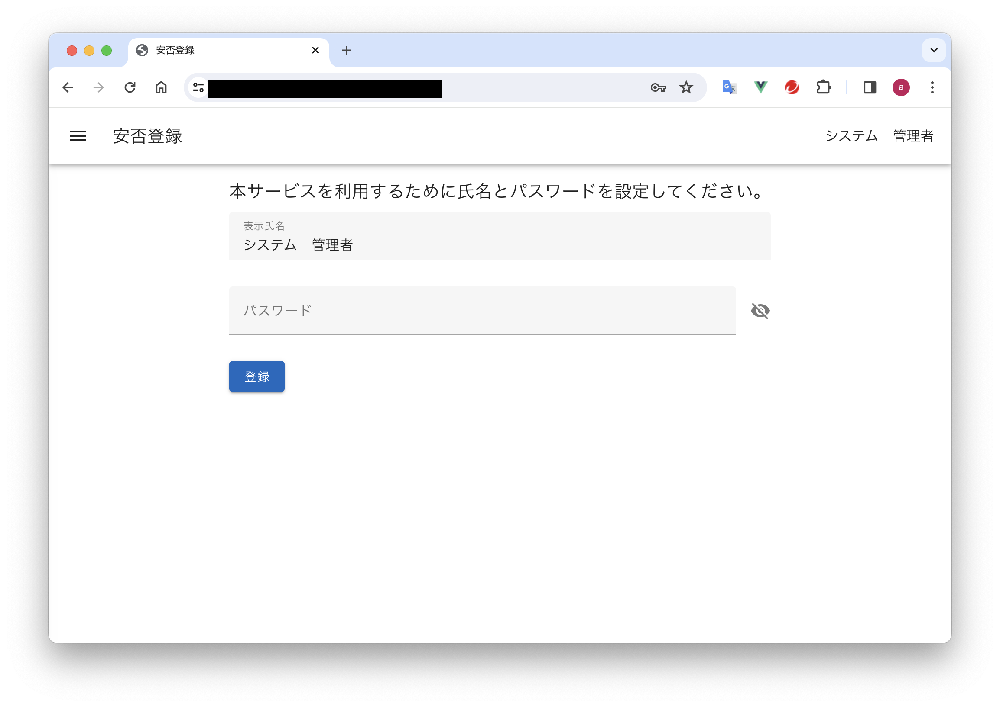

# BCP Project

Vue と JavaScript のスキル習得のために作成した安否登録アプリです。

## アプリのユースケース

### ログイン

管理者から ID とパスワードを案内されたユーザーのみ本アプリを利用できます。

### 自分の安否状況を登録する。

安否状況を登録し、管理者権限ユーザーに安否状況を共有できます。

### ユーザーの安否状況を確認する。

ユーザーの最新安否状況を確認できます。  
※管理者権限を持つユーザーのみ利用可能。

### ログイン中ユーザーの氏名とパスワードを変更する。

表示氏名とパスワードを変更できます。

### ユーザーの特別権限を編集する。

ユーザーに対して特別権限を付与・削除できます。  
※システム管理者権限を持つユーザーのみ利用可能。

## マニュアル

[こちらを参照してください](./manual/manual.md)

## プロジェクト構築記録

### Vue3 によるフロントエンドプロジェクトの作成

フロントエンドの作成記録は、[こちら](./bcp-web-app/README.md)を参照。
