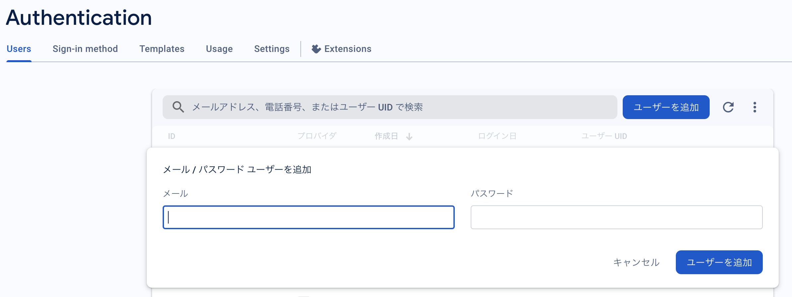
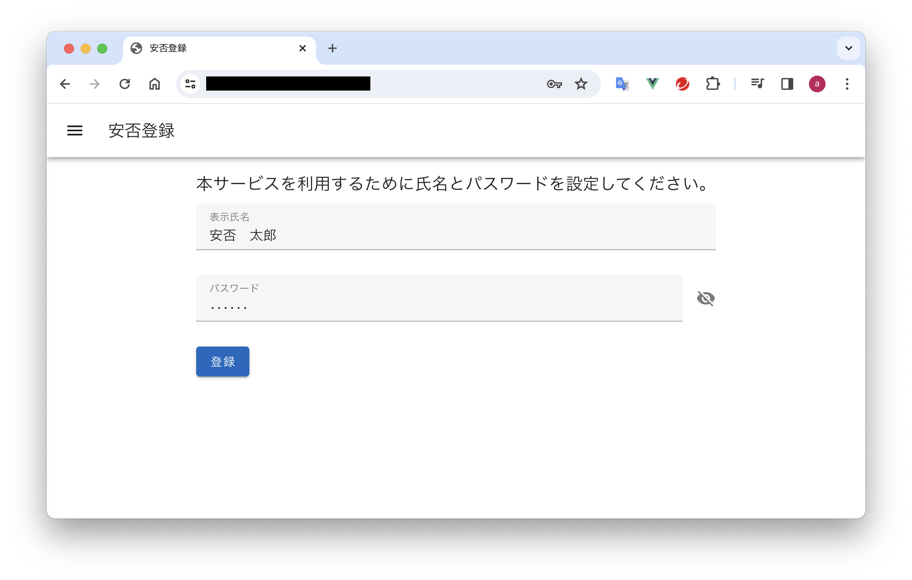
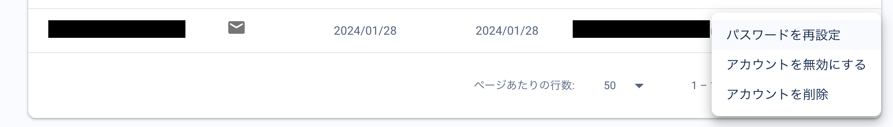
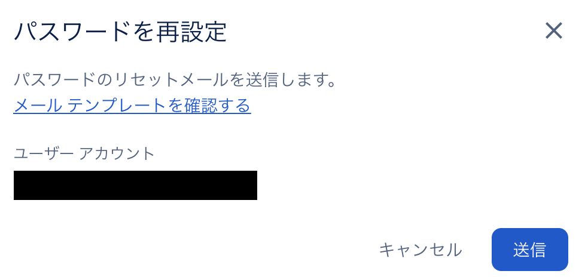
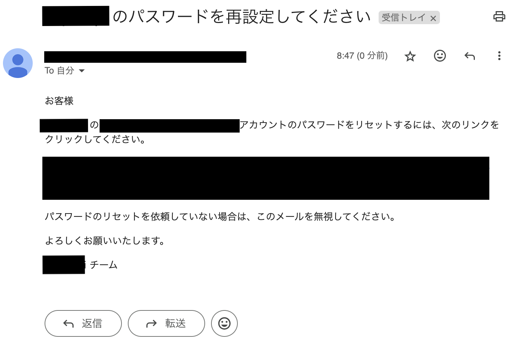
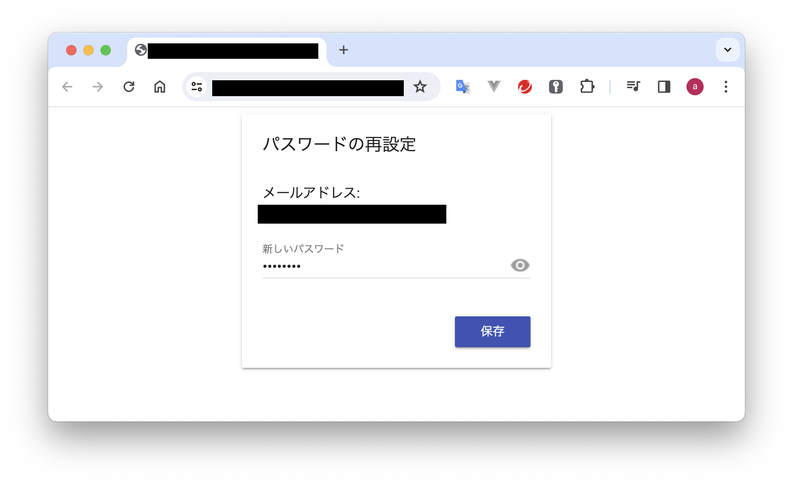
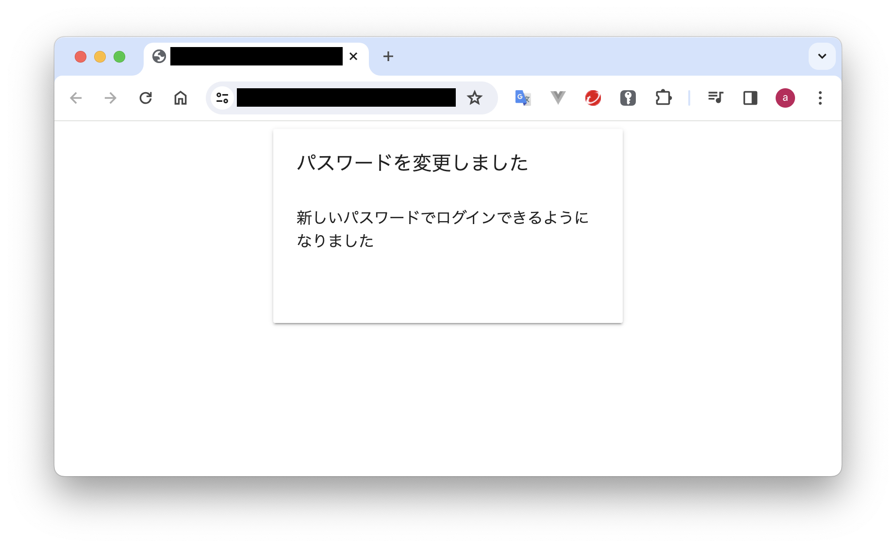

# マニュアル

## ユーザーの追加

Firebase 管理者が Firebase コンソールの`Authentication`からユーザーアカウントを作成し、利用者に初期パスワードを伝えます。

利用者は、初回ログイン時に氏名とパスワードを変更します。  
（利用者が氏名とパスワード登録するまで安否登録はできません）

### 管理者の手順

1. Firebase コンソールでプロジェクトを選択し、`Authentication`を開きます。

1. `Users`タブの`ユーザーを追加`ボタンをクリックし、追加したいユーザーのメールアドレスとパスワードを入力してユーザーを追加します。

   

1. 利用者に初期パスワードを伝えます。

### 利用者の手順

1. 管理者から伝えられた初期パスワードで安否登録アプリにログインします。

1. ログイン直後にプロファイル入力画面が表示されるので、氏名とパスワードの入力を入力し、登録ボタンをクリックします。

## ユーザーの削除

Firebase 管理者が Firebase コンソールの`Authentication`からユーザーを削除します。

## パスワードを忘れた場合

Firebase 管理者が Firebase コンソールの`Authentication`から利用者のパスワード再設定操作を行うと利用者にパスワードリセットメールが届きます。

利用者はパスワードリセットメールのリンクからパスワードを再設定できます。

### 管理者の手順

1. Firebase コンソールの`Authentication`から対象ユーザーを選択し、`パスワードを再設定`をクリックします。

   

1. パスワードリセットメールを送信します。

   

### 利用者の手順

1. パスワードリセットメールのリセット URL をクリックします。

   

1. パスワードを再設定する画面が表示されるので、新しいパスワードを入力します。

   

   
